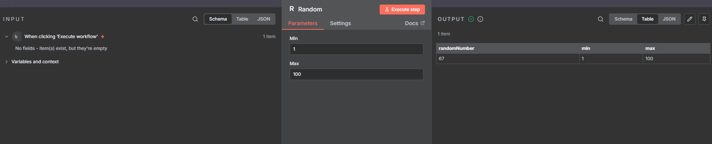

# Desafio Onfly: Gerador de Número Aleatório para n8n

Este repositório contém um nó customizado para a plataforma de automação **n8n**. O conector, chamado **"Random"**, permite gerar números aleatórios verdadeiros utilizando a API pública do **Random.org**, com base em valores de mínimo e máximo definidos pelo usuário.



---

### **Motivação e Aprendizado**

Como desenvolvedor focado em **Java**, este desafio me proporcionou uma excelente oportunidade para sair da minha zona de conforto e mergulhar no ecossistema Node.js e TypeScript. Dediquei tempo para entender a arquitetura do n8n, as melhores práticas para a criação de nós customizados e a integração com APIs externas.

Apesar de ser um tema novo para mim, encarei o desafio com entusiasmo, buscando adquirir o conhecimento necessário para entregar uma solução completa e de qualidade, exatamente como o n8n e a Onfly esperam.

---

### **Estrutura do Projeto**

O projeto foi construído com os seguintes componentes:

* **Node.js + TypeScript**: Linguagens de programação utilizadas para desenvolver o conector.
* **Docker Compose**: Ferramenta para gerenciar e executar o n8n e um banco de dados PostgreSQL.
* **n8n**: Plataforma de automação low-code que hospeda o conector.
* **Random.org**: API utilizada para a geração dos números aleatórios.

```bash
A estrutura de pastas segue as convenções do n8n para nós customizados:
├── .n8n/
│   └── custom/
│       └── random/
│           ├── Random.node.ts
│           └── icon.svg
└── docker-compose.yml
└── README.md
```

O código do nó se encontra em `.n8n/custom/random/Random.node.ts`.

---

### **Como Executar o Projeto**

Siga os passos abaixo para rodar a aplicação localmente com Docker Compose:

**1. Pré-requisitos:**

* Docker e Docker Compose instalados na sua máquina.

**2. Instalação e Execução:**

* Clone este repositório para a sua máquina local:
    ```bash
    git clone https://github.com/Hyzaaki/desafio-onfly.git
    cd clone https://github.com/Hyzaaki/desafio-onfly.git
    ```
* Suba o n8n usando o Docker Compose:
    ```bash
    docker-compose up -d
    ```

**3. Acesso ao n8n:**

* Aguarde alguns instantes para que os contêineres sejam iniciados.
* Acesse a interface do n8n em seu navegador: `http://localhost:5678`
* O nó customizado "Random" já estará disponível no painel de nós.

---

### **Como Usar o Conector**

1.  Crie um novo workflow no n8n.
2.  Adicione um nó **"Random"** (você pode encontrá-lo pesquisando na lista de nós).
3.  Configure os valores **"Min"** e **"Max"** nos parâmetros do nó.
4.  Execute o workflow. O resultado será um JSON contendo o número aleatório gerado pela API do Random.org.

---

### **Contato**

* Isaac Alves Schuenck
* i.alvessc01@gmail.com
* https://www.linkedin.com/in/isaac-alves-schuenck/
* (31) 98351-3722
